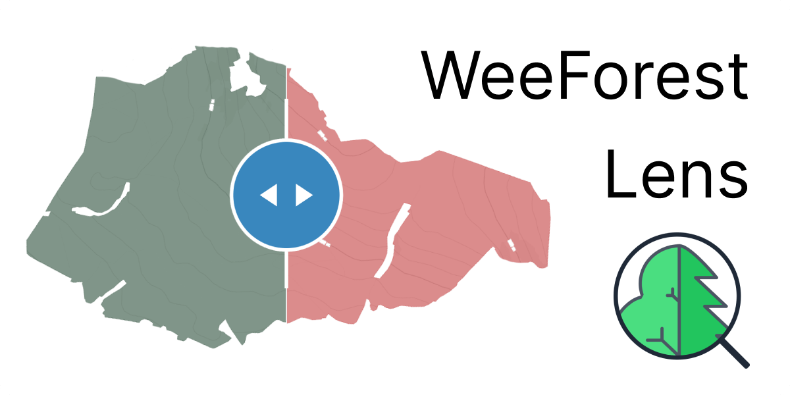

# Mapping trees of the United Kingdom

🗺️ Interactive map: [WeeForest Lens](https://weeforest.org/lens/)  
🌐 Website: [WeeForest](https://weeforest.org/)  
🔬 Methodology & Findings: [Research](research/README.md)

## Disclaimer

This work is not indented to be a piece of scientific research, nor is it a journalistic piece. It's a personal project that aims to make the data about trees in Great Britain more accessible and understandable, whilst still maintaining good industry practices.

I do not claim accuracy, expertise or authority in the field. I am, however, passionate about data, distraught about the state of biodiversity in the UK and want to see it improved, and firmly believe that the first step to get there is helping others see the issues I observed. *- Mike Neverov, 2024*

## Inspiration

On one of the drives across the Scottish Highlands I have noticed rows of what seemed like rocks left on the hillsides around us, next to lush and orderly rows of conifers. Puzzled and back home I looked up the area on satellite maps and after a few minutes of searching discovered the reality of forestry industry in the UK.

Being already rather sad about the overall state of biodiversity on the British Isles I wanted to learn where can I find the "real trees" that I could visit or enjoy driving by. I quickly learned that only a fraction of Scottish (and British for that matter) woodlands are native, and of the "woodland" reported by Forestry Commission's National Forest Inventory, almost 20% or some `500,000 ha` are currently Felled and Barren, devoid if any visible vegetation as of 2022.

This lack of transparency in definition has prompted me to visualise it, which led me on a spiral of data collection, methodology analysis and learning about the evolution of definition of "woodland", "native trees", "trees outside woods" and other relevant terms in the UK tree-related discourse.

## Structure of this repository

This repository combines three distinct components:

- Data analysis and processing carried out via Python and Jupyter Notebooks. Data processing, MBTiles generation, area calculation and experiments reside there. Visit the relevant [readme](data/README.md) for details.
- Lens - folder with the map viewer application, tasked with visualising the data, providing frontend and user interaction. Details of setting it up are documented [within](lens/README.md).
- Research folder, containing files and references to various pieces of information, methodology, analysis and sources used in the project. Most justifications and observations regarding source data and it's aggregation will be found [there](research/README.md).

Separately there's a [docker](docker) folder with a sample docker compose configuration and some other configuration files in the root of the solution.

> All of the relevant documentation and instructions are available in respective folders, please refer to them for more information.

## Installation

As this repository doesn't have neither raw nor processed data attached, you would need to perform a few steps to get the .mbtiles and .parquet files used in area visualisation calculation:

1. Clone the repository
1. Configure VSCode to run Jupyter Notebooks by installing Python, Jupyter and Polyglot Notebooks extensions
1. Configure the git filter to remove Notebook outputs: `git config filter.strip-notebook-output.clean 'jupyter nbconvert --ClearOutputPreprocessor.enabled=True --to=notebook --stdin --stdout --log-level=ERROR'`
1. Run the [AWI Notebook](data/uk_gb_awi.ipynb) after downloading the data from the Sources section within - this will generate the Ancient Woodland Inventory data.
1. Run the [NFI Notebook](data/uk_gb_nfi.ipynb) after downloading the data from the Sources section within - this will generate the National Forest Inventory data.
1. Run the [Overlay Notebook](data/uk_gb_nfi_awi_overlay.ipynb), to completion - this will overlay both datasets and produce the overlay data.
1. Run the [Area Calculation Notebook](data/uk_gb_areas.ipynb) to completion - generating the point datasets for area calculation.
1. Finally, run the [MBTiles Notebook](data/uk_gb_tiles.ipynb) to generate the .mbtiles files for the map, 23 in total, around 4.5GB total size.
1. Set up the .env file in the [lens](./lens/) directory, following the instructions in the [lens readme](./lens/README.md).
1. With everything done, you should be able to run the dev server via `npm run dev`, or production in docker via `npm run docker: build` in lens and `docker-compose up` in docker folders, assuming `.env` files were set up correctly. First few minutes will be spent generating indexes so the area calculation might be unresponsive.

## Contributing

Contributions are encouraged and welcome. The project roadmap, ideas, bugs and issues are tracked in the [Project](https://github.com/users/MNeverOff/projects/4).

Currently we'd be especially grateful for help with:

1. Better MBTiles generation, achieving a smooth and equal distribution across all zoom levels, with lower .mbtiles file sizes and better performance.
2. Satellite basemap creation for each of the dataset years, allowing to add contextual satellite imagery.
3. Reimplementing Mapbox styles with terrain and hillshading using open data, which would allow to move to maplibre-gl completely.
4. Help with data access, especially the TOW and hedges geospatial datasets.
5. Assistance expanding the coverage to other countries.

Consult the relevant project (Data, Lens, Research) for a more detailed list if ideas and priorities.

## Acknowledgements

I want commend following organisations and people, for without their work this project would not be possible:

- People of the National Forest Inventory and Forestry Commission for providing the data and making it available to the public, including woodland, ecological condition and trees outside woodland datasets
- The Native Woodland Survey of Scotland team for the best piece of native woodland research and mapping in the UK to date
- Various maintainers and contributors to the Ancient Woodland Inventories

Separately, want to extend my thanks to:

- [Mykhailo Matviiv](https://github.com/FireNero/) for allowing my to bounce ideas off him and brainstorming certain performance improvements
