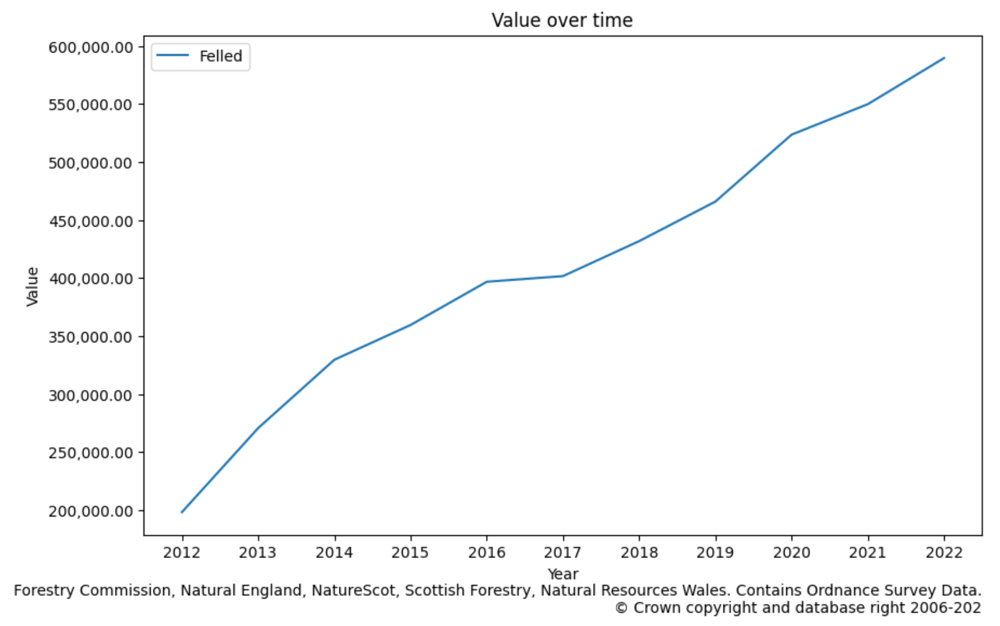
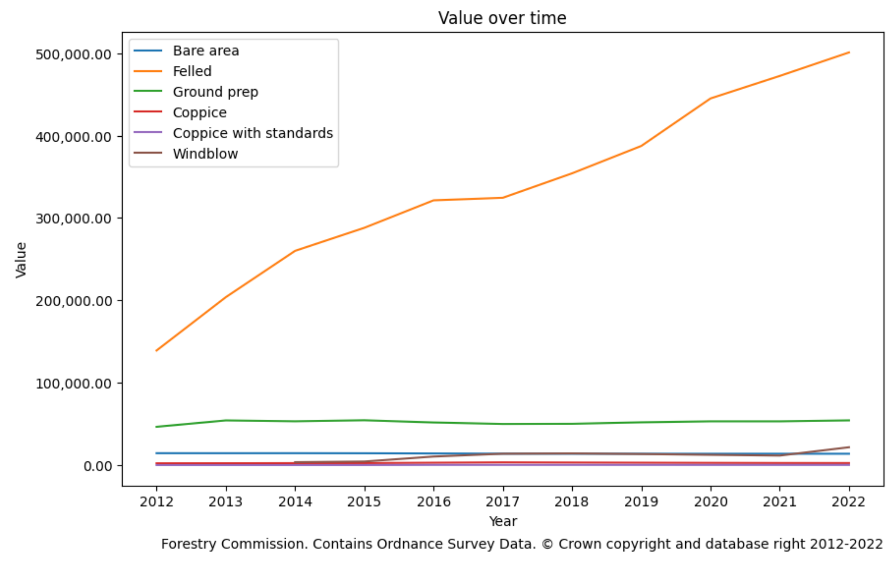
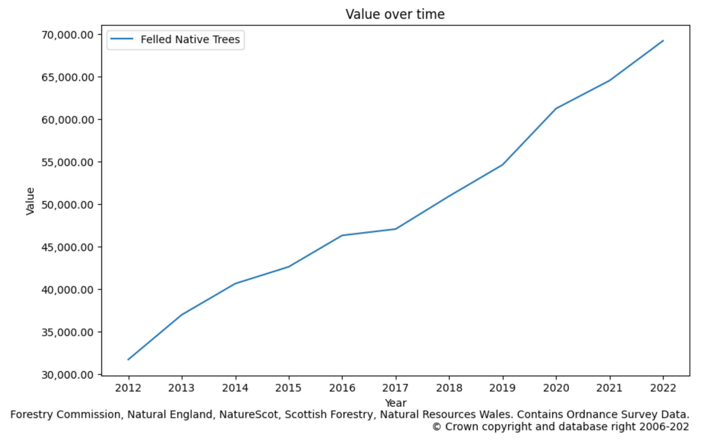
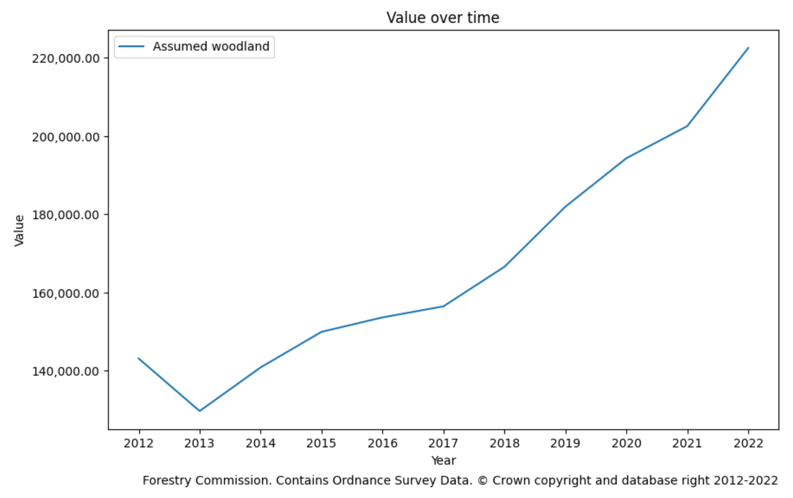

# WeeForest Lens - Research

- [WeeForest Lens - Research](#weeforest-lens---research)
  - [Overview](#overview)
  - [Contributing](#contributing)
  - [Sources](#sources)
    - [Unavailable sources](#unavailable-sources)
    - [Auxiliary sources](#auxiliary-sources)
  - [Methodology](#methodology)
    - [Existing Research](#existing-research)
    - [Ancient Woodland Inventory (AWI) Dataset](#ancient-woodland-inventory-awi-dataset)
    - [National Forest Inventory (NFI) Dataset](#national-forest-inventory-nfi-dataset)
    - [NFI x AWI Overlay](#nfi-x-awi-overlay)
    - [Tile Generation](#tile-generation)
    - [Area Calculation](#area-calculation)
    - [On Northern Ireland data and GB vs UK use](#on-northern-ireland-data-and-gb-vs-uk-use)
  - [Key Findings](#key-findings)
    - [Woodland Area, Great Britain, 2022](#woodland-area-great-britain-2022)
    - [Trees Area, Great Britain, 2022](#trees-area-great-britain-2022)
    - [Overall Area, Great Britain, 2022](#overall-area-great-britain-2022)
    - [Ancient Woodland Inventories](#ancient-woodland-inventories)
    - [National Forest Inventory Dataset](#national-forest-inventory-dataset)
  - [Modern UK Woodland Data Assessment and Improvement Ideas](#modern-uk-woodland-data-assessment-and-improvement-ideas)
    - [NFI Woodland Ecological Condition](#nfi-woodland-ecological-condition)
    - [National Forest Inventory](#national-forest-inventory)
    - [TBD: ONS](#tbd-ons)
    - [TBD: Carbon Storage Credit Scheme](#tbd-carbon-storage-credit-scheme)
    - [TBD: International Experience](#tbd-international-experience)
  - [Afterword](#afterword)

## Overview

This readme contains a detailed overview of the project's methodology, data sources and research that was conducted to create WeeForest Lens.

There's also an opinionated [Assessment](#modern-uk-woodland-data-assessment-and-improvement-ideas) section that makes comments on the state of the UK's existing woodland research and data.

## Contributing

I would love to learn more about sources I have potentially missed, whether of statistical or geospatial nature. You can also check out the issues in the [Project](https://github.com/users/MNeverOff/projects/4) for more specific action items.

Currently the following would be of particular help:

1. Helping with accessing the TOW, Hedges and UKLC datasets or facilitating their acquisition by getting in touch with the people in respective organisations. The Trees Outside Woods is an especially valuable dataset as it would help represent a truer picture of the UK Native Trees proportion and distribution.
1. Pointing out methodological errors, especially around the aggregation of AWI and NFI datasets, as well as the assumptions made in the process.
1. Helping with selecting datasets that could reasonably be used to represent the Northern Ireland's woodland and trees.

## Sources

There are two main geospatial sources used in the project:

- [National Forest Inventory (NFI)](https://data-forestry.opendata.arcgis.com/search?q=National%20Forest%20Inventory) datasets, 2012 - 2022. Years 2010 and 2011 are omitted due to incompatible data typing.
- Ancient Woodland Inventories (AWI) for [England](https://www.data.gov.uk/dataset/9461f463-c363-4309-ae77-fdcd7e9df7d3/ancient-woodland-england), [Scotland](https://www.data.gov.uk/dataset/c2f57ed9-5601-4864-af5f-a6e73e977f54/ancient-woodland-inventory-scotland) and [Wales](https://www.data.gov.uk/dataset/1db7cbc0-2eef-4c3b-85be-73c7b87d4c87/ancient-woodland-inventory) as well as [Native Woodland Survey of Scotland](https://www.data.gov.uk/dataset/da3f8548-a130-4a0d-8ddd-45019adcf1f3/native-woodland-survey-of-scotland-nwss) (NWSS) data.

Whilst NFI is comprehensive for forestry and woodlands, as well as updated yearly, it lacks the Trees Outside Woods data, hedges data as well as any designation of nativeness of the trees. AWI and NWSS datasets provide a good baseline for the Ancient and Native trees, but are somewhat static and don't provide a unified feature set or update schedule.

### Unavailable sources

Currently unavailable to me due to either licensing or prohibitive cost:

- [Hedgerows geospatial data via UKCEH Land Cover Plus: Hedgerows 2016-2021 (England)](https://www.ceh.ac.uk/data/ukceh-land-cover-plus-hedgerows-2016-2021-england) - locked away by credentials
- [Trees Outside Woods geospatial data via the National Tree Map™️](https://bluesky-world.com/ntm/) - proprietary by BlueSky
- [NFI Woodland Ecological Condition Geospatial Dataset](https://www.forestresearch.gov.uk/tools-and-resources/national-forest-inventory/what-our-woodlands-and-tree-cover-outside-woodlands-are-like-today-nfi-inventory-reports-and-woodland-map-reports/nfi-woodland-ecological-condition/) - isn't provided by the NFI, I assume due to them using the BlueSky trees-outside-woods dataset
- [UK Land Cover Maps, 2007 - 2021](https://catalogue.ceh.ac.uk/documents/c0078881-7d5a-4641-91e2-c271426bc8a1) - locked away by credentials and £300 admin fee

All of these datasets would be of immense value to the mission of the project and all and any help and guidance on how to access them would be greatly appreciated.

### Auxiliary sources

Throughout the work I have been constantly trying to ensure my calculations and assumptions are correct and without major flaws. Sources helpful in doing so include:

- [ETH Global Canopy Height 2020](https://langnico.github.io/globalcanopyheight/) for cross-referencing the resulting "Standing Trees" data
- [GLAD Global Land Cover and Land Use Change, 2000-2020](https://glad.umd.edu/dataset/GLCLUC2020/)
- [State of the UK’s Woods and Trees 2021](https://www.woodlandtrust.org.uk/media/51705/state-of-the-uks-woods-and-trees-2021-thewoodlandtrust.pdf)

## Methodology

The project's methodology is based on the aggregation of the Ancient Woodland Inventory (AWI) and National Forest Inventory (NFI) geospatial datasets, with the goal of creating a comprehensive map of the UK's woodland and trees.

Since both datasets, their constituent parts and methodologies are different, a number of assumptions, aggregations and simplifications had to be made in order to create a coherent and consistent dataset.

One if the driving factors behind this work was realisation that there's no comprehensive, UK- or GB-wide research into the area of Native Trees, not to mention that there isn't one that would attempt it on a rolling yearly basis. The closest one is NFI's Woodland Ecological Condition (WEC) study, but it lacks geospatial data and is based on a 2013 baseline.

### Existing Research

In the question of defining and cataloguing trees on the territory of Great Britain there are three authoritative studies that can be used as a starting point:

1. [NFI Woodland Ecological Condition](https://www.forestresearch.gov.uk/tools-and-resources/national-forest-inventory/what-our-woodlands-and-tree-cover-outside-woodlands-are-like-today-nfi-inventory-reports-and-woodland-map-reports/nfi-woodland-ecological-condition/). This is the first British assessment of the extent of native woodland and priority habitat type based on a balanced stratified random sample of woodlands.
1. The Native Woodland Survey of Scotland (NWSS), a census of native woods in Scotland, dated 2012 (survey took place between 2006 and 2013). This identified, surveyed and mapped the location, extent, type and condition of all of Scotland's native and nearly native woods, as well plantations on ancient woodland sites (PAWS). Used in NFI WEC for Scotland.
1. JNCC created estimates of the area of priority HAPs in 1998 using National Vegetation Classification (NVC) data, utilising 2,648 samples taken in ancient and recent woods throughout Britain (Rodwell 1991).

Direct comparisons between the estimates from NFI, NWSS and the 2008 JNCC NVC HAP estimates to describe native woodland extent should not be made because of differences in the methodologies (as referenced in NFI WEC report).

There is also a wonderful [Woodland Trust's State of the UK's Woods and Trees 2021](https://www.woodlandtrust.org.uk/media/51705/state-of-the-uks-woods-and-trees-2021-thewoodlandtrust.pdf) that servers as a great starting point as well as reference directory for the UK's woodland research as the team has processed hundreds of sources in course of creating it.

### Ancient Woodland Inventory (AWI) Dataset

As detailed in the [Ancient Woodland Inventory Notebook](../data/uk_gb_awi.ipynb), for the purposes of WeeForest Lens, AWI dataset is combined from AWI England, AWI Wales and NWSS datasets. The specifics of aggregation and combination of features are detailed in the notebook itself.

Briefly, the approach is to create "Native" and "Semi-Native" categories and map all of the three AWI datasets to these categories, so that later in the Overlay both of which could be considered "Native" in the simplified representation. There is also an "Other" category for open land habitat and similar features that are attributed to woodland but can't be considered as "having trees".

### National Forest Inventory (NFI) Dataset

As the NFI datasets is one that undergone the most changes over the years, it contains the most assumptions and simplifications during aggregation. They can be viewed in detail in the [National Forest Inventory Notebook](../data/uk_gb_nfi_geospatial.ipynb). The main issue is aggregating over 20 different polygon types into something that could be cohesively represented and overlayed.

There's also a significant portion of areas reporting of which isn't clear or seems inaccurate upon inspection, i.e. areas marked as "Felled" that clearly have visible vegetation on them or significant areas of "Assumed woodland" that have been standing bare for years. I go into more detail regarding my criticism of the NFI's data and research in the [Assessment](#modern-uk-woodland-data-assessment-and-improvement-ideas) section.

Generally, the approach is to create seven categories on first pass:

- Broadleaved
- Conifer
- Barren & Felled
- Mixed (conifer & broadleaved)
- Young Trees
- Other (assumed & uncertain)
- Other (land, urban, etc.)

And then to map these into three categories:

- Trees
- Barren & Felled
- Other (land, urban, etc.)

Whilst not ideal, this approach allows to confidently overlap this dataset with the combined AWI dataset and produce a coherent representation of trees and lack thereof on the woodlands of Great Britain.

### NFI x AWI Overlay

The main goal is to create a dataset that represents the combined AWI and NFI datasets in a way that is coherent and consistent, detailed in the [Overlay Notebook](../data/uk_gb_nfi_awi_overlay.ipynb). The main issue is the lack of definition of "woodland" in the NFI dataset that is clear enough for our purposes, as it includes felled areas that are not guaranteed to be restocked.

Current approach is to use spatial overlay for each year of the NFI data to produce five categories:

- Native Trees. These are areas from the AWI dataset of Trees, minus any overlap with NFI's non-Trees areas.
- Non-Native Trees. Areas from the NFI dataset designated as "Trees" minus the AWI overlap.
- Felled Trees. Areas from the NFI dataset designated as "Barren & Felled" minus the AWI overlap.
- Felled Native Trees. Areas from the AWI dataset not designated as "Trees" that overlap with the NFI's Felled or Other.
- Other NFI. Areas from the NFI dataset designated as "Other" minus the AWI overlap, as well as all "Other" areas from the AWI dataset.

> [Crude Overlay Drawing](../assets/overlay_drawing.png)

This approach allows us to very closely map the native tree areas, with a few slight oversimplifications such as assuming that areas mapped in NFI as "Other" but also present in AWI Trees are Felled, which might be incorrect in some cases and potentially should be revised. The area of such overlap is relatively small, varying between 5,000 and 10,000 ha in most years.

The approach itself is also not entirely methodologically correct since we're overlaying a dynamic dataset (NFI) with a static one (AWI), but it's the best we can do with the data we have, and it's sadly reasonable enough to assume that little new native forests emerged in the last 10 years.

### Tile Generation

Tiles are generated via `tippecanoe` in [Tiles Notebook](../data/uk_gb_tiles.ipynb) notebook. The polygons for each of the datasets (NFI, AWI, NFIxAWI) are simplified to `1e-5` precision, assigned labels for each of the type aggregation mappings and then converted to `mbtiles` format. Conversion parameters vary from dataset to dataset, aiming to provide the best balance between detail and size.

### Area Calculation

For area calculation we're reducing the geometries to a centroid and using simple coordinate comparison to gauge a rough approximation of the areas within the viewport. It's adequate and is multiple orders of magnitude faster than using a more precise method, such as spatial intersection, whilst yielding a good enough result for an overwhelming majority of cases.

### On Northern Ireland data and GB vs UK use

Unfortunately, the majority of sources on the topic don't represent Northern Ireland in any meaningful way, making the decision on whether to include it a difficult one. Northern Ireland datasets are scarce, the most authoritative is the [Northern Ireland Ancient Woodland Inventory (NIAWI)](https://ati.woodlandtrust.org.uk/back-on-the-map/) ([see map](https://woodlandtrust.maps.arcgis.com/apps/webappviewer/index.html?id=5cea220a4b974bd78016248ce66a5a49)), created by the Woodland Trust in 2002 - 2007. But lack of NFI data for Northern Ireland makes it impossible to treat data for NI in the same way as for the rest of the UK. The only other source is the [Northern Ireland Woodland Registry](https://www.daera-ni.gov.uk/publications/woodland-register) which doesn't provide geospatial data.

For the purposes of starting this project I decided to focus on Great Britain, which is UK without Northern Ireland and overseas territories. I will allow myself to use the terms "Great Britain" and "the United Kingdom" rather interchangeably throughout this project as it's my goal to include Northern Ireland at first opportunity and I want ensure that more people can discover this project, and using the term "United Kingdom" is more likely to achieve that.

## Key Findings

Throughout the project a number of findings was made and the ones deserving special attention are detailed below.

### Woodland Area, Great Britain, 2022

This data is obtained by overlaying the NFI data with AWI data and vice-versa as described in the [Methodology](#nfi-x-awi-overlay) section for the overlay. It provides an accurate representation of the Native and Other Woodlands and their makeup, as opposed tot he Woodland Area Analysis above taken without regard for overlapping areas.

| Category | Area (ha) | Percentage (%) |
|---|---|---|
| Native Trees | 751,774.52 | 23.25% |
| Non-Native Trees | 1,821,455.81 | 56.33% |
| Native Felled Trees | 69,198.71 | 2.14% |
| Other Felled Trees | 520,532.26 | 16.10% |
| Other (land, pasture, urban, etc.) | 70,764.91 | 2.18% |
| **Total Woodland** | **3,233,305.22** | |

Total non-unique in both: 4,056,685.05 ha
Total intersection between datasets: 823,379.83 ha

For presentation purposes:

| Category | Area (ha) | Percentage (%) |
|---|---|---|
| Native Woodland | 750,000 | 25% |
| Standing Timber | 1,820,000 | 55% |
| Barren & Felled | 590,000 | 20% |
| **Total "woodland"** | **3,160,000** | |

### Trees Area, Great Britain, 2022

Now if we were to include Trees-outside-Woods into the comparison, whilst excluding the Barren & Felled areas, we would get a more representative image of the GB's tree cover (land cover, canopy cover):

| Category | Area (ha) | Percentage (%) |
|---|---|---|
| Native Woodland | 751,775 | 22.68% |
| Trees Outside Woods | 742,000 | 22.38% |
| **Subtotal good trees** | **1,493,775** | **45.06%** |
| Other Trees (forestry) | 1,821,456 | 54.94% |
| **Total tree cover** | **3,315,231** | |

For presentation purposes:

| Category | Area (ha) | Percentage (%) |
|---|---|---|
| Native Woodland | 750,000 | 23% |
| Trees Outside Woods | 740,000 | 22% |
| Standing Timber | 1,820,000 | 55% |
| **Total tree cover** | **3,310,000** | |

> Note: there's a further 158,600 ha of hedgerows and linear woody features that could be attributed to the "good trees" category

### Overall Area, Great Britain, 2022

| Category | Area (ha) | Percentage (%) |
| --- | --- | --- |
| Native Trees | 750,000 | 3.20% |
| Trees Outside Woods | 742,000 | 3.17% |
| *Subtotal good trees* | *1,492,000* | *6.37%* |
| Standing Timber | 1,820,000 | 7.76% |
| *Subtotal tree cover* | *3,312,000* | *14.13%* |
| Barren & Felled | 590,000 | 2.52 |
| *Subtotal Woodland and TOW* | *3,902,000* | *16.65%* |
| Hedgerows | 158,600 | 0.67% |
| *Remaining* | *19,379,600* | *82.68%* |
| **Total Great Britain** | **23,440,200** | |

> NFI WEC Report claims that the area of Native trees might be as high as 1,500,000ha as of 2013 baseline data. See the [NFI WEC Section](#nfi-woodland-ecological-condition).

Below are auxiliary findings and calculations, usually taken with no regard for the spatial overlap of the datasets:

<details>
  <summary>Overall Area, Great Britain, 2022</summary>

Data acquired from the datasets representing the latest (2022) state of the Great Britain's overall area and "good" trees (Native Trees, Trees Outside Woodland and Hedgerows) is as follows:

| Category | Area (ha) | Percentage (%) |
|---|---|---|
| **Total Great Britain** | **23,440,200** | **100.00%** |
| Native Trees | 811,900 | 3.46% |
| Trees Outside Woodland | 742,000 | 3.17% |
| **Subtotal good trees** | **1,553,900** | **6.63%** |
| | | |
| Hedgerows | 158,600 | 0.68% |
| **Subtotal good trees + hedges** | **1,712,500** | **7.31%** |
| | | |
| Other Trees (forestry) | 1,493,782 | 6.37% |
| **Subtotal all trees + hedges** | **3,206,282** | **13.68%** |
| | | |
| *Remaining* | *20,233,918* | *86.32%* |

</details>

<details>
  <summary>Woodland Area Analysis, Great Britain, 2022</summary>

Data as a straight sum of statistical figures by both the NFI and AWI, assuming no overlap between the areas, which we know is not accurate.

| Category | Area (ha) | Percentage (%) |
|---|---|---|
| Ancient Woodlands | 607,290 | 18.91% |
| Semi-Ancient Woodlands | 204,610 | 6.38% |
| **Subtotal native woodland** | **811,900** | **25.29%** |
| Other Woodland | 1,493,783 | 46.52% |
| Barren & Felled | 579,961 | 18.06% |
| Other (urban, uncertain, etc) | 325,298 | 10.13% |
| **Total woodland** | **3,210,941** | **100.00%** |

Other woodland here is Broadleaved + Conifer + Young trees + Mixed - Ancient - LEPO & Roy
`1,113,022 + 881,291 + 212,027 + 99,343 - 607,290 - 204,610 = 1,493,783`

</details>

### Ancient Woodland Inventories

The files below represent the current best understanding of "Native Woodlands" that the UK has to offer as of 2024. The main term used is "Ancient Woodland" and it's defined differently in different countries of the Union, but mostly refers to "continuously wooded areas since at least 1600 AD".

This is not perfect, as ideally I would like to have access to a geospatial dataset listing all Native Trees in the UK like the NFI WEC, but we'll have to assume that Ancient Woods represent all or most Native trees in the UK.

#### AWI Summary

This takes NWSS data over the AWI Scotland data since it's much more well detailed and researched.

| Type | Area |
| --- | --- |
| Native Forest | 567,943.17 ha |
| Semi-Native Forest | 253,055.77 ha |
| Other (land, pasture, unknown, etc.) | 24,745.01 ha |
| **Total** | **845,743.96 ha** |

<details>
  <summary>AWI England</summary>

| Type | Area |
| --- | --- |
| Ancient & Semi-Natural Woodland| 215,032.94 ha |
| Ancient Replanted Woodland | 149,743.54 ha |
| Ancient Wood Pasture | 137.84 ha |
| **Total** | **364,909.10 ha** |
</details>

<details>
  <summary>AWI Scotland</summary>

| Type | Area |
| --- | --- |
| Long-Established (of plantation origin) | 215,032.94 ha |
| Ancient (of semi-natural origin) | 149,743.54 ha |
| Other (on Roy map) | 137.84 ha |
| **Total** | **352,766.04 ha** |
</details>

<details>
  <summary>NWSS</summary>

| Type | Area |
| --- | --- |
| Native woodland | 311,153.49 ha |
| PAWS | 39,671.79 ha |
| Nearly-native woodland | 13,382.95 ha |
| Open land habitat | 21,771.48 ha |
| **Total** | **385,979.70 ha** |
</details>

<details>
  <summary>AWI Cymru (Wales)</summary>

| Type | Area |
| --- | --- |
| Ancient Semi Natural | 41,756.74 ha |
| Plantation on Ancient Woodland Site | 26,970.28 ha |
| Restored Ancient Woodland Site | 23,287.22 ha |
| Ancient Woodland Site of Unknown Category | 2,833.73 ha |
| Restored Ancient Semi Natural Woodland | 1.97 ha|
| **Total** | **94,849.94 ha** |
</details>

### National Forest Inventory Dataset

The annual NFI dataset is the single most comprehensive source for the UK when it comes to analysing the dynamics of the UK's woodlands and trees. There are a few alarming trends or ones that I can't quite find explanation for that I'll showcase below.

#### Felled Area growing 300% in 10 years

Most important figure to showcase is the growth of the Felled area. Below it's presented as a combination of Felled, Coppice, Windblow and Ground Prep.



This demonstrates a stark rise of the felled areas over the years, from a combined 200,000 ha to a staggering 600,000 ha over the span of 10 years, getting close to the total area of Native Woodlands in the entirety of the UK.

When digging deeper and chain-analysing the changes from year to year it becomes clear that most of that Felled area is the very same area throughout the years. Comparing years side by side usually yields the following results, sorted by area:

```text
2012 -> 2023
Total 'Felled' area on the left: 139,192.03 ha
Felled -> Felled: 138,800.66 ha
Felled -> Young trees: 342.23 ha
... (rest insignificant)
```

```text
2014 -> 2015
Total 'Felled' area on the left: 260,134.83 ha
Felled -> Felled: 255,010.00 ha
Felled -> Young trees: 3,064.11 ha
Felled -> Ground prep: 1,959.82 ha
... (rest insignificant)
```

```text
2021 -> 2022
Total 'Felled' area on the left: 472,459.15 ha
Felled -> Felled: 472,311.16 ha
Felled -> Conifer: 86.80 ha
... (rest insignificant)
```

This rather clearly shows that most of the Felled areas come from formerly wooded ones, and very few of them are restocked in a comparable quantity. A more comprehensive visualisation is pending.

<details>
  <summary>Source NFI Dataset figures with breakdown by subtypes</summary>

  

  To provide a detailed insight and dispel assumptions about misrepresenting the growth by including different underlying areas, provided is the Felled area chart in NFI's own classification. The only two areas to substantially grow are Felled, from 139,000 ha to 501,000 ha and Windblow, from 3,600 ha in 2014 to 22,000 ha (no data prior to 2014 available)
</details>

#### Felled Native Trees increasing twofold



Inexplicably, the area registered in the Ancient Woodland Inventories as Wooded (so, not Open Land Habitat and similar) that overlaps with NFI's Felled and "Other" areas has started off at 32,000 ha and has grown to 70,000 ha in the past decade. Whilst it's not possible to draw a decisive conclusion as the AWI datasets are static, the trends that this might suggest are alarming.

Most of the area has been lost to:

```text
Felled      54,042.75 ha
Ground prep 8,062.67 ha
Grassland   2,277.63 ha
Windblow    1,779.42 ha
Coppice     1,747.05 ha
```

So, yeah, it seems like the absolute majority of 70,000 ha of Native Woodland just got Felled as part of the forestry activity. Which is a damn shame and a tremendous loss.

#### Assumed Woodland Growth

As defined in NFI's Geospatial [Attributes Description](../research/nfi/nfi_geospatial_attributes.pdf), the "Assumed Woodland" is:

> The Supplied grant scheme polygons and supplied FC new planting polygons have been attributed as 'assumed woodland' as these areas have not been checked against the latest images and will be monitored in future updates and either updated to reflect forest type or removed from the dataset.



However, when taken over time, they have grown from 140,000 ha to 220,000 ha in the past decade, indicating either a large pace of new "assumed woodland" acquisition, or a failure to "reflect forest type or remove from the dataset" in a consistent manner. This value is important because it constitutes a large portion of the "Other" category that can't be reliably attributed or assessed for nativeness.

## Modern UK Woodland Data Assessment and Improvement Ideas

The most authoritative source of information about trees in Great Britain is Forestry Commission's National Forest Inventory. I believe that as a government body they should be tasked, among other things, with maintaining and collecting data on the state of the UK's woodlands and trees, in all of it's extent, including the degree of their nativeness and biodiversity, data on which is lacking compared to commercially-driven data related to wood production and forestry.

As is the case with most of the notes in this section, expressions below are not meant as my whole and cohesive opinion on the research or people who carried it out. I want to take a moment to admire the incredible work put into the studies over the years, the fact that they exist in the first place and make clear that I respect the people who worked on them immensely, and any criticism or questions raised below are mainly aimed at flawed definitions and conditions in which people had to work and the UK Forestry Commission's goals as a whole.

### [NFI Woodland Ecological Condition](https://www.forestresearch.gov.uk/tools-and-resources/national-forest-inventory/what-our-woodlands-and-tree-cover-outside-woodlands-are-like-today-nfi-inventory-reports-and-woodland-map-reports/nfi-woodland-ecological-condition/)

Sources: [Statistics Report](https://cdn.forestresearch.gov.uk/2022/02/fr_nfi_wec_statistics_gb_rq817af.pdf), [Methodology](https://cdn.forestresearch.gov.uk/2022/02/fr_nfi_condition_scoring_methodology_dj8ftgq.pdf), [Worksheet](https://cdn.forestresearch.gov.uk/2022/02/fr_nfi_scores_by_native.xlsx)

The NFI Woodland Ecological Condition (NFI WEC) is perhaps the single most useful piece of NFI research regarding nativeness of trees produced to date. Broadly, it reports that `49.5%` or `1,507,105 ha` of GB's woodland can be considered native, with a further `1.86% (56,776 ha)` near-native & fragments, with total GB woodland **habitat** area reported at `3,045,290 ha`. This figure of native trees comes in stark contrast with the `823,967.27 ha` reported and categorised in Ancient Woodland Inventories across England, Wales and Scotland (NWSS data), suggesting that "woodland" is almost double the previously estimated size.

This figure also doesn't include the `900,600 ha` of Trees Outside Woods (TOW) and Hedges. So if we are to take NFI's native woods research at face value, the combined native vegetation in the GB is `2,464,481 ha` or `10.51%` of the GB's land area.

The research has an excellent paragraph on the difficulty of assessing the "nativeness" of trees, issues with using parcel-level and stand-level assessments as well as complex history of the UK's woodlands development that complicates the measurement, see. p. 83 - 95 of [NFI Woodland Ecological Condition Scoring Methodology](https://cdn.forestresearch.gov.uk/2022/02/fr_nfi_condition_scoring_methodology_dj8ftgq.pdf).

It brings up the difficulty of defining native woodland, ultimately settling on going for the "stands" approach over "parcels" as that scales better and is more accurate for the purposes of the study. The report also introduces the definition of "Woodland Habitat", but I failed to find justification for it's use versus the flawed, but established, NFI definition of "woodland" or find a clear "conversion" between the two. I assume that this has to do with the UK BAP Habitat targets / definitions but I wasn't able to pick it up from the report or the methodology notes.

It's important to note that the baseline for the estimates is set at 2013, when the combined woodland area reported by NFI sat at `3,096,720 ha`. The report does make a note regarding comparison of `Woodland habitat are` that they're operating with:
> Area includes a revision to underlying total woodland area (this will be revised in Forestry Facts and Figures Sept 2020). Comparisons with woodland area should not be made as woodland area is defined differently to woodland habitat (with woodland area being greater than habitat area due to the treatment of land uses like open space and clear-fell).

#### Definition of Native Woodland

One of the two issues I take with the report is it's definition of Native Woodland and the thresholds for "Favourable, Intermediate and Unfavourable" conditions.

Study's definition of Native woodland on p. 17-18, seemingly mirrors the AWI definition, specifically:
> Stands with 50% or more native tree species occupancy in the upper canopy that either:
> • Form a discrete woodland parcel with a minimum area of 0.5 ha.
> • Form a woodland stand with a minimum area of 0.1 ha that is part of a woodland that is > 0.5 ha or larger.

However, further on on p. 36 it defines per-country thresholds for "Favourable, Intermediate and Unfavourable" conditions. Most curiously, it's different between England & Wales and Scotland:

| Country | Percentage cover of native trees | Condition classification |
| --- | --- | --- |
| England and Wales | > 80% | Favourable |
|  | 50-80% | Intermediate |
|  | < 50% | Unfavourable |
| Scotland | > 90% | Favourable |
|  | 80 - 90% | Intermediate |
|  | < 80% | Unfavourable |

The report justifies it by stating:
> These were adjusted for Scotland due to differences in country level targets and reporting. To achieve a favourable condition rating in the native occupancy assessment, a greater proportion of native species is required in Scotland (>90%) compared to England and Wales (>80%). By setting a higher threshold to achieve a favourable status in Scotland, this assessment provides a more conservative estimate of woodland condition when there is a relatively high proportion of non-native species in its canopy.

If one observes the final figures of the WEC study for Native trees one can find:
| Country | Type | Unfavourable | Intermediate | Favourable |
| --- | --- | --- | --- | --- |
| England | Native | 101,150 ha | 192,858 ha | 620,087 ha |
|   | Near native & fragments | 5,697 ha | 10,121 ha | 13,641 ha |
|   | Non native | 234,373 ha | 93,080 ha | 70,733 ha |
| Scotland | Native | 179,119 ha | 156,638 ha | 106,854 ha |
|   | Near native & fragments | 8,969 ha | 6,222 ha | 5,122 ha |
|   | Non native | 827,267 ha | 57,389 ha | 23,603 ha |
| Wales | Native | 17,859 ha | 35,931 ha | 96,609 ha |
|   | Near native & fragments | 1,343 ha | 3,337 ha | 2,324 ha |
|   | Non native | 98,777 ha | 38,185 ha | 17,860 ha |

However, if we were to take the [Distribution dataset for Nativeness](https://cdn.forestresearch.gov.uk/2022/02/fr_nfi_nativeoccupancydistributions_native.xlsx), elements of which are referenced on p. 25 of the [Statistics Report](https://cdn.forestresearch.gov.uk/2022/02/fr_nfi_wec_statistics_gb_rq817af.pdf), which removes the arbitrary 50% initial threshold and apply Scotland's thresholds across the board we would get:

| Country | <80% native | 80-90% native | 90%+ native |
| --- | --- | --- | --- |
| England | 554,332 ha | 74,008 ha | 715,106 ha |
| Scotland | 1,001,637 ha | 24,919 ha | 362,675 ha |
| Wales | 182,907 ha | 13,068 ha | 116,968 ha |
| **Great Britain** | **1,738,876 ha** | **111,994 ha** | **1,194,749 ha** |

*Total area: `3,045,619 ha`, total values for <80% native include "non determinable".*

> Note: So, we're already down from the 1,500,000 ha to 1,300,000 ha when defining the "Native" woodlands at the 80% threshold on the stand level.

This is an incredible result, however, lack of geospatial data available to check that result against modern conditions and latest NFI data makes it difficult to accurately assess the claimed number.

There is a note that areas without canopy cover and clear-fell sites with a weak vegetation layer are attributed to the "non determinable", but the total area of such is just `19.632 ha` with `1,706 ha`, `17,208 ha` and `718 ha` in England, Scotland and Wales respectively.

Note: there is a valuable note in the [Draft Procedure](https://cdn.forestresearch.gov.uk/2022/04/FR_Draft_proposal_NFIreporting_on_ForestCondition_2013_cnLwoq6_Barsoum.pdf) for Reporting on Forest Condition from 2013, p. 13, that sheds light onto the difference in thresholds a bit more, and sets the backdrop for the 80% threshold in England & Wales:
<details>
  <summary>Reporting on Forest Condition from 2013, p. 13</summary>

> For consistency, comparability and to meet all countries’ requirements, a condition score report will be established at 50% native canopy cover for each country and Great Britain.
> Then, if a new definition of 50% for England cannot be sanctioned^1, either:
>
> - A separate score will also be calculated for an 80% threshold of ‘native’ for England.
> Or
> - The threshold for ‘green status’ of the ‘nativeness of canopy’ attribute will be set to 80% (instead of 90%) for all countries so that one assessment can be made for Great Britain, with England simply reporting only those woods with green status for canopy nativeness.
>
> The approach taken will be discussed at the November meeting.
>
> ^1 This may not be as difficult as it may first appear. To date, analysis of the NFI data shows that whether 50% or 80% is applied will not significantly alter the values produced as circa 96% of broadleaved woodland has over 90% native canopy cover, as evidenced by initial analysis of the NFI sample squares.
>
> For Scotland it was assumed that the required analysis of ‘all woodland’ would be split into two analyses: one for native woodland and one for non-native woodland separately. For the purpose of utility and consistency these figures will also be supplied for England and Wales. This interpretation needs to be confirmed prior to further analysis.
</details>

#### Definition of woodland and inclusion of felled (clearfelled, windblow, transition) areas

The report seems to largely follow the NFI's flawed "woodland" terminology that includes felled areas. Specifically, the NFI definition of woodland, as per [NFI Woodland Ecological Condition Scoring Methodology](https://cdn.forestresearch.gov.uk/2022/02/fr_nfi_condition_scoring_methodology_dj8ftgq.pdf), p. 16:

> The NFI defines a woodland as an area of land meeting these criteria:
>
> 1. Any area of land with an established tree canopy where the tree cover extends to at least 20% of the land and the whole area of land is greater than 0.5 ha in extent and over 20 m in width.
> 1. Open spaces of less than 0.5 ha or less than 20 m in width within the woodland (e.g. rides, glades, ponds).
> 1. Areas of clear-felled or windblown woodland for up to 10 years after the clear-fell or windblow event, if a change of land use has not been established.
> 1. Areas covered by young trees that are a minimum of 0.5 ha in extent, or that are adjacent to established woodland, forming a total area of at least 0.5 ha. This may have resulted from planting, natural regeneration or colonisation that has not yet established a continuous canopy.

This definition mirrors one given to "woodland" in all modern NFI works and is present in the Glossary of the WEC study:
> Woodland (or forest): Land predominately covered in trees (defined as land under stands of trees with a canopy cover of at least 20%, or the ability to achieve this, and with a minimum area of 0.5 hectare and minimum width of 20 m), whether in large tracts (generally called forests) or smaller areas known by a variety of terms (including woods, copses, spinneys or shelterbelts).

Both of the definitions share a glaring issue - **they include Felled areas** that are in no way guaranteed to have been restocked since. There is a procedure to obtain [felling licences](https://www.gov.uk/government/publications/tree-felling-getting-permission/tree-felling-getting-permission) that requires restocking under Part 2 of the 1967 Act, but it's not clear how the areas restocked in connection to the felling is tracked, if at all.

For better understanding and context, the Felled area reported by the NFI Spatial data has grown from `139,192.03 ha` in 2012 to `500,980.00 ha` in 2022, representing an average annual rise of `32,889.82 ha` which is way out of line with the restocking, wood production and planting rates reported.

As of 2013 (baseline for WEC report), the felled area was reported at `203,926.42 ha` with total area at `3,096,720 ha`. This raises significant questions to the `3,045,290 ha` total woodland habitat area in the NFI WEC report, as it already included `97,456 ha` of "Clearfelled & transition", but the `51,430 ha` difference in total area is not explained.

This can be explained in part by the "10 year" period of felled/windblown area definition in the WEC report but doesn't explain the discrepancy in definitions within NFI. If area is Felled and is considered "Woodland" then it should either be restocked and marked as such or not be reported as woodland at all.

#### NFI WEC Summary

The report is a great step forward by NFI and I commend the people working on it, as a lot of great science, surveying and data analysis has been done. It also provides a lot of quantitative data to work and interpret in relation to other datasets.

Ultimately, primarily due to absence of geospatial data within the dataset, the report's findings can not be a major part of this work. Having the geospatial data would be crucial and incredibly valuable, since it could then be overlayed with AWI and NFI data, studied with other thresholds for definition of "native" and enable better visualisation and research.

### National Forest Inventory

There are two notable issues that I find frustrating with the way this dataset is used and presented to the public:

- Inclusion of Felled areas in the total area of Woodland and lack of consistent notice of the fact in most of NFI reports.
- Lack of reporting on areas harvested in any given year, the only indication is year-over-year change in Felled areas, but as of my research right now it doesn't even begin align with Wood Produced as [reported by NFI](https://www.forestresearch.gov.uk/tools-and-resources/statistics/statistics-by-topic/timber-statistics/uk-wood-production-and-trade-provisional-figures/), which is a significant issue.

Many regions that are available in the 2022 dataset and are marked as "felled" are rather clearly visibly wooded or have vegetation growing on them, which can partly explain the incredible growth of the Felled category in the recent decade. I think that it should be a priority to rectify this discrepancy.

This raises following questions:

1. Why there's no tracking of specific areas that were harvested with obligation to restock that's linked to the Wood Production? Currently the areas harvested are only reported geospatially post factum, based on remote sensing (satellite imagery).
1. Why does the Felled area increase so much and doesn't seem to be restocked?
1. Why does the Assumed Woodland increase, and at such a pace?

### TBD: ONS

TBD ([data](https://www.ons.gov.uk/economy/environmentalaccounts/bulletins/woodlandnaturalcapitalaccountsuk/2022#glossary), [methodology](https://www.ons.gov.uk/economy/environmentalaccounts/methodologies/woodlandnaturalcapitalaccountsmethodologyguideuk2022))

£ value from timber <<<
£ value from everything else including carbon credits >>>

### TBD: Carbon Storage Credit Scheme

TBD

### TBD: International Experience

TBD (EU definitions of Woodland varies country by country Some include felled areas as well.)

## Afterword

It's infuriating that NFI doesn't apply enough effort to dispel the perception of "woodland" as "land with trees". It's exceptionally apparent in the wording of many of their reports, as well as express absence of the words "felled" in reports that can reach 100 pages or more.
Good example is NFI literature using "woodland" as general term and in it's **full** volume including felled areas when talking and "adding up" TOW areas which are explicitly Trees.

Even the [Forestry Statistics 2023](https://cdn.forestresearch.gov.uk/2023/09/Ch1_Woodland.pdf) report that "includes canopy cover" for the first time references the  [Environmental Targets (Woodland and Trees Outside Woodland) (England) Regulations 2023](https://www.legislation.gov.uk/uksi/2023/90/contents/made) which still set targets as "woodlands and TOW" whilst allowing "woodland" to be clearfelled, as defined as:

“woodland” does not include energy forestry and means an area of trees of at least 0.5 hectares with a minimum width of 20 metres with at least 20% of that area covered in tree canopy cover or which could sustain tree canopy cover and includes:
(a) areas of integral open space within the boundary of such an area of trees, each of which is less than 0.5 hectares;
(b) land which is to be restocked pursuant to a felling licence under Part 2 of the 1967 Act.

Meaning that felling a bunch more trees is no issue, see **or which could sustain tree canopy cover** - meaning that it can be just stumps.

And sure enough, on page 59 the 1,330,000 ha of "Woodland" in England is included in "Total canopy cover", alongside 586,000 ha of ToW and 24,000 ha of orchards, rightfully so on the last two. But out of 1,330,000 ha "Woodland" in England 94,730 ha were **Felled**, and including them in the Canopy Cover metric feels incredibly misleading.
